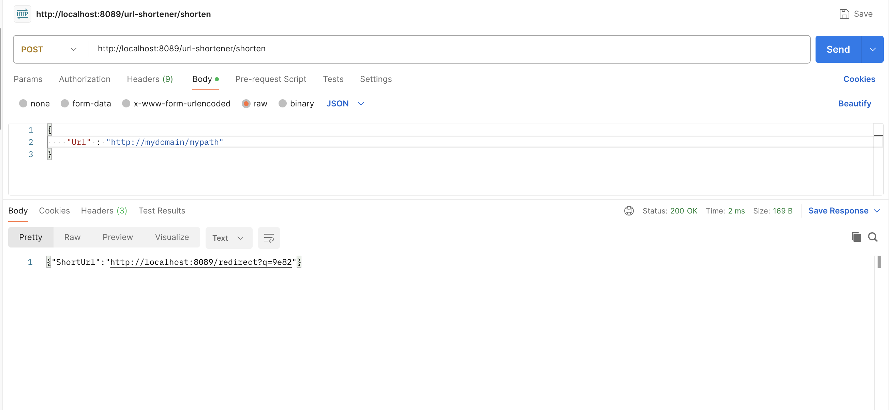
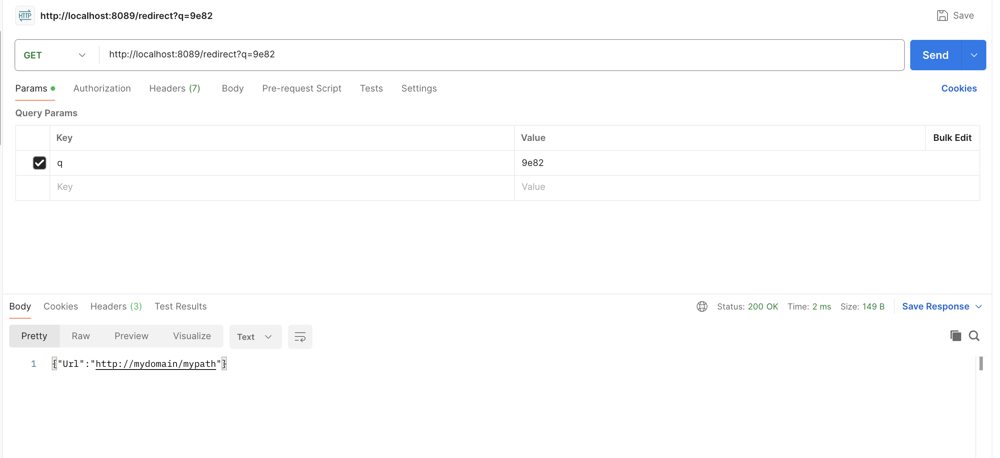
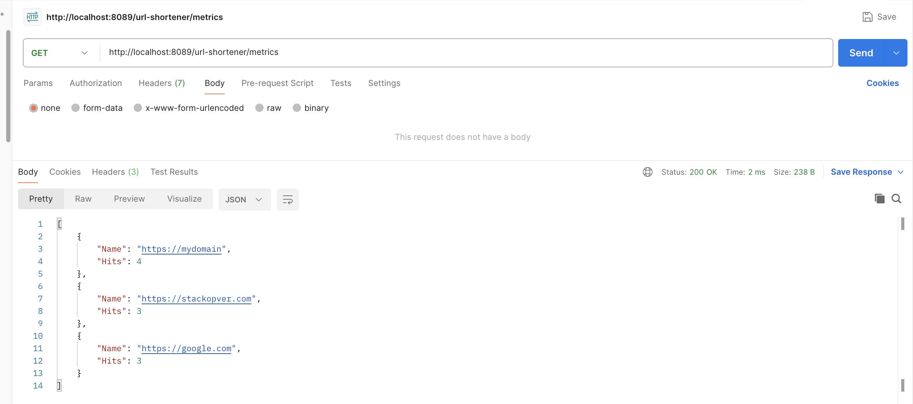
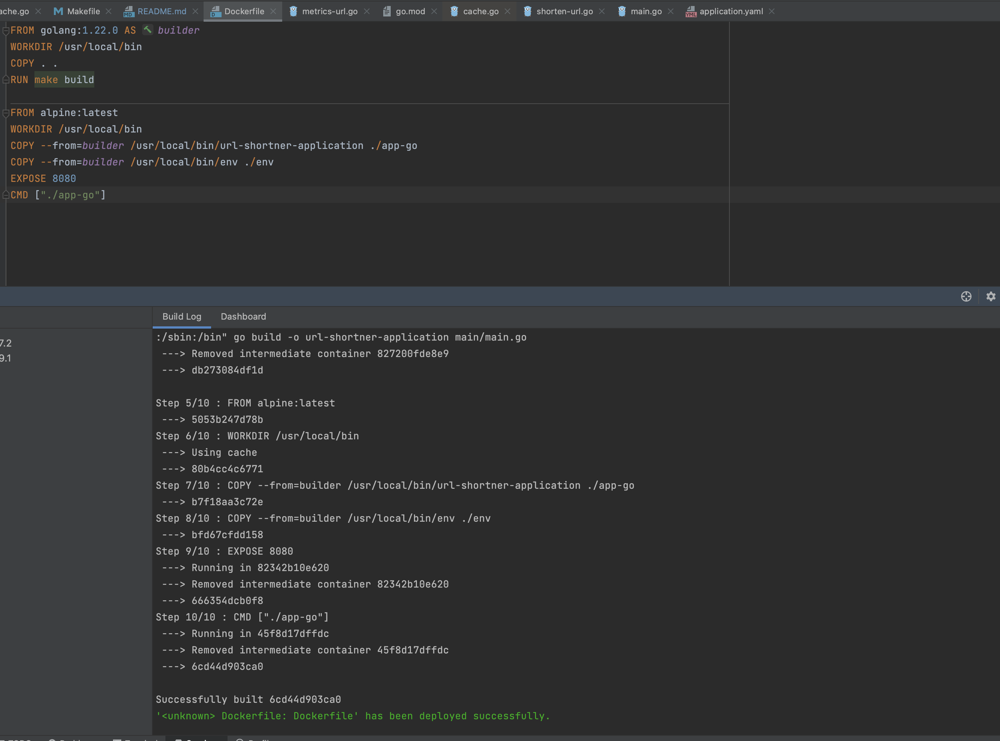
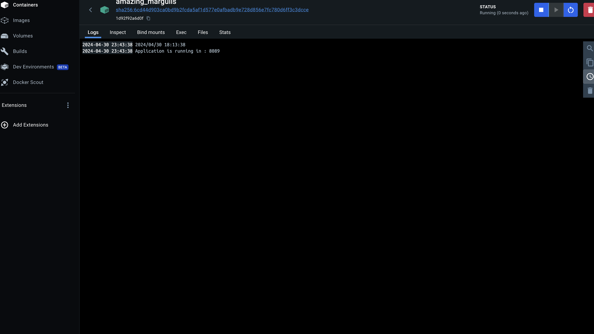
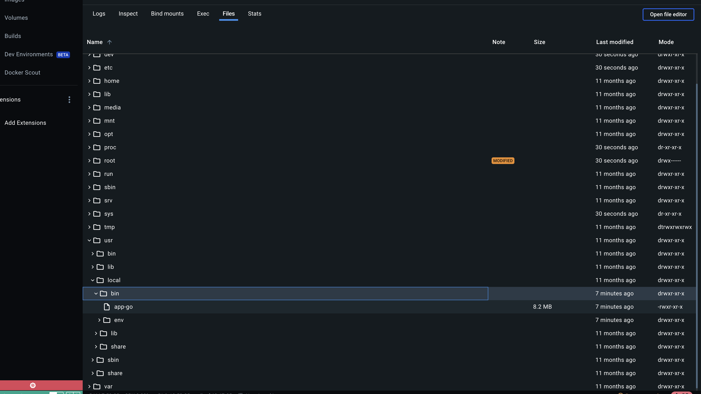

# INTRODUCTION
1. Build a simple URL shortenerservice that will accept a URL as an argument over a REST API and
return a shortened URL as a result. 
    * If you have not used orseen a URL shortener before - please visit https://bitly.com/ and
try to shorten a URL. The goal of this assignment is not to build a fancy UI but an API only version of that. 
    * Don’t use a shortening API - you are supposed to write that part of code. 
    * We expect your assignment to have a decent architecture. 
2. The code should have following features:
    * If I again ask for the same URL, itshould give me the same URL as it gave before instead
of generating a new one. 
    * If the user clicks on the short URL then he should be redirected to the original URL. Write a Redirection API that implements this functionality. 
    * The URL and shortened URL should be stored in-memory by application. 
    * [BONUS] Instead of in-memory,store these things in a caching solution such as Redis, Memcached etc (Or file if you really want). 
3. Write a metrics API that returns top 3 domain names that have been shortened the most
number of times. For eg. if the user hasshortened 4 YouTube video links, 1 StackOverflow link, 2
Wikipedia links and 6 Udemy tutorial links. Then the output would be:
Udemy: 6
YouTube: 4
Wikipedia: 2
4. [BONUS] Put this application in a Docker image by writing a Dockerfile and provide the docker image link along with the source code link.

# TECH-STACK
* go version - 1.22.0
* framework - Gorilla mux
* IDE : Intellij IDEA
* Http Client : Resty
* Postman
* Cache - gocache
* Docker Desktop - 4.28.0

# FAQ
* Total APIs - 3
* use Makefile to build and run the project

# IMAGES
1. Shortening URL : /url-shortener/shorten - POST
   
2. Redirecting URL : /redirect - GET
   
3. Metrics API : /url-shortener/metrics - GET
   
4. Docker Image built successfully
   
5. Docker image running successfully in Docker desktop
   
6. executable formed in Docker
   
